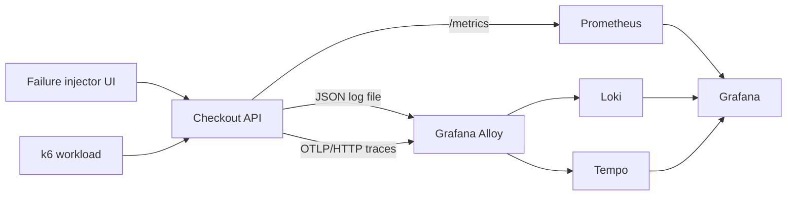

# Signal Room

Signal Room is a small checkout service built to answer one practical question:

> When a user says “checkout is broken,” can you move from symptom to evidence without guessing?

The project creates correlated **metrics, logs, and traces** for three controlled scenarios: a normal request, a slow dependency, and a failed payment. A provisioned Grafana dashboard turns those signals into an investigation workflow, while Prometheus rules demonstrate actionable alerting.

This is a learning environment—not a screenshot-only dashboard. Every panel is backed by telemetry generated by the included application.

## What is included

- A dependency-free Node.js checkout simulator with health and readiness endpoints.
- Prometheus counters and histograms using the text exposition format.
- Structured JSON logs designed for low-cardinality Loki labels.
- W3C-compatible trace IDs and OTLP/HTTP trace export through Grafana Alloy to Tempo.
- A provisioned Grafana dashboard connecting RED metrics, logs, and traces.
- Prometheus alerts for high error rate and p95 latency.
- A k6 workload mixing normal, slow, and failed checkouts.
- Unit, integration, smoke, and configuration checks in CI.
- An incident runbook and a publishable technical article draft.

## Architecture



## Run the complete lab

Prerequisites: Docker Desktop with Docker Compose.

```bash
docker compose up --build -d
```

Open:

- Failure injector: <http://localhost:8080>
- Grafana: <http://localhost:3000> (`admin` / `admin`)
- Prometheus: <http://localhost:9090>
- Alloy component view: <http://localhost:12345>

Click each scenario several times, then open the **Signal Room** folder in Grafana. For a repeatable traffic mix:

```bash
docker compose --profile load run --rm k6
```

Stop the environment and remove its local data:

```bash
docker compose down -v
```

## Run the application without Docker

Node.js 22 or newer is enough. The app intentionally has no package dependencies.

```bash
npm start
```

Then run the automated checks:

```bash
npm test
npm run check
```

## Verify each signal

### Metrics

```bash
curl http://localhost:8080/metrics
```

Important series:

- `signal_room_checkout_requests_total{outcome}`
- `signal_room_checkout_scenarios_total{scenario}`
- `signal_room_checkout_duration_seconds`

### Logs

The service emits JSON with `scenario`, `outcome`, `durationMs`, and `traceId`. Alloy parses only bounded fields such as `level`, `scenario`, and `outcome` into Loki labels. Trace IDs remain inside the log body because indexing one label value per request would create a high-cardinality problem.

### Traces

Each checkout exports one OTLP span through Alloy to Tempo. The Loki datasource defines a derived `TraceID` field, so a log entry can open the related trace without manually copying identifiers.

### Alerts

The included rules intentionally wait before firing:

- Error rate greater than 10% for one minute.
- p95 checkout latency greater than one second for two minutes.

This prevents a single training click from creating a noisy page while still making sustained k6 failure traffic visible.

## Investigation exercise

1. Run the normal scenario five times to establish a baseline.
2. Run the slow scenario repeatedly or start the k6 profile.
3. Find the p95 increase in Grafana.
4. Narrow the dashboard time range to the spike.
5. Open a structured log and follow its derived TraceID into Tempo.
6. Use [`docs/runbook.md`](docs/runbook.md) to classify the incident.

## Repository map

```text
src/                  checkout service, metrics, logging, trace export
public/               failure-injection interface
ops/alloy/            log and trace collection pipeline
ops/grafana/          provisioned datasources and dashboard
ops/loki/             local log storage
ops/prometheus/       scraping and alert rules
ops/tempo/            local trace storage
load/                 k6 workload
test/                 automated application tests
docs/                 architecture notes, runbook, and article draft
```

## Design boundaries

This repository is a local educational deployment. It deliberately uses filesystem storage, local credentials, and loopback-bound ports. A production deployment would add TLS, secret management, durable object storage, authentication, backups, multi-tenancy, and separate failure-injection controls.

## Contributing

Small, testable improvements are welcome. Read [`CONTRIBUTING.md`](CONTRIBUTING.md) before opening a pull request.

## License

MIT
